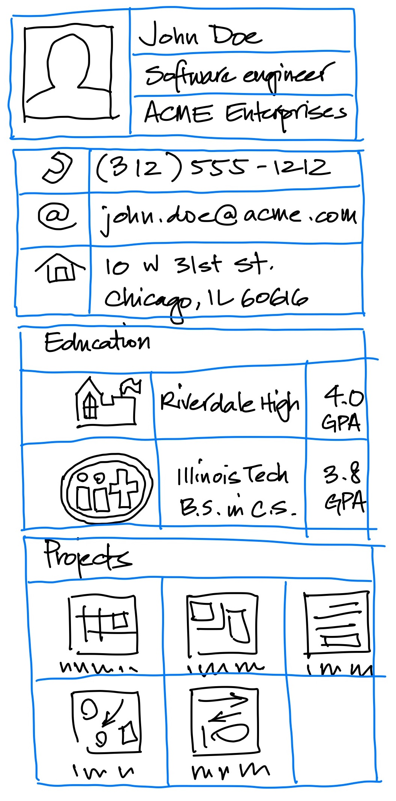

# Profile Page

# 1. Overview
In this project, I developed a single-screen application that showcases a "profile information" page for a user, which can be either myself or a fictional character, in the context of a social networking application. The application draws inspiration from various platforms, such as professional networking and dating apps.

The main objective of this project was to explore and experiment with the different display and layout widgets available in the Flutter framework. I focused on structuring the code to enhance reusability and maintainability.

# 2. Specifications
When executed, my application displays a single scrollable screen featuring static user information organized into multiple visually distinct sections. These sections align with the theme of the hypothetical social networking application. For instance, in a professional networking app, you might find sections like "Contact," "Education," and "Projects," while a dating app could feature "About Me," "Interests," and "My Photos."

The layout and content of the profile page are open to creative interpretation, but it adheres to the following requirements:

Distinct Sections: Include a minimum of four sections, each visually distinguished through techniques like nesting, padding, or background colors.
Images: Incorporate at least three images.
Nested Widgets: Utilize at least one nested row or column widget, where each nested widget contains a minimum of two children.
Here's a mockup of what the page might look like (scrolling is supported if necessary to view the entire page in the live application):


Here’s a version with blue lines to indicate rows, columns, and grids in the layout.



# 3. Implementation Details / Requirements
3.1. Project Setup
This repository includes a basic Flutter project structure that I used as a foundation for my implementation. I modified the lib/main.dart file and created additional Dart files in lib/ as necessary for custom widgets or data model classes.

Images used in the app were added to the assets/images directory.

3.2. User Data Model
While the finished app's layout and content are static (i.e., non-interactive), I structured my code to separate content from layout specifications. I avoided hard-coding data into widgets.

Instead, I created classes to represent and store user information, referred to as the data model. Instances of these classes were passed to my widgets for display, allowing content changes without altering widget code.

For example, I defined a UserInfo class that looks like this:


```dart
class UserInfo {
  final String name;
  final String position;
  final String company;
  final String phone;
  final String email;
  final String address1;
  final String address2;

  // each entry is a record with named fields that describe a degree
  final List<({String logo, String name, double gpa})> education;

  // each entry is an instance of `ProjectInfo` that contains project details
  final List<ProjectInfo> projects;
  
  // ... constructor, etc.
}
```

Our `main` function, then, might be structured like this:

```dart
void main() {
  // build the user info object
  UserInfo userInfo = UserInfo(
    name: 'John Doe',
    position: 'Software Engineer',
    company: 'ACME Enterprises',
    phone: '(312) 555-1212',
    email: 'john.doe@acme.com',
    address1: '10 W 31st St.'
    address2: 'Chicago, IL 60616'
  );
  userInfo.addEducation(
    logo: 'assets/images/illinois-tech-logo.png',
    name: 'RAndom name',
    gpa: 3.8
  );
  // etc.

  // hand the user info object to the root widget
  runApp(MaterialApp(home: UserInfoPage(userInfo: userInfo)));
}
```

we can create your data model objects elsewhere in your project, but the key is to define them separately from your widget code.

### 3.3. Widget structure

I explored various widget structures while ensuring my widget tree included at least one instance of each of the following widget types (multiple instances of some are included):

- `AppBar`
- `Column`
- `Container`
- `Image`
- `ListView`
- `MaterialApp`
- `Row`
- `Scaffold`
- `SizedBox`
- `Text`

Optional widgets that you may find useful/interesting:

- `Card`
- `Expanded`
- `GridView`
- `ListTile`
- `SingleChildScrollView`

I defined multiple custom widget classes, such as a UserInfoPage widget for overall layout and separate widgets for each section within a section. This improved code organization and facilitated layout changes.

## 4. Testing

As the page is static, functional testing was unnecessary. Evaluation was conducted by compiling and running the app in a supported Flutter platform (e.g., MacOS, iOS, Android, or web) and visually inspecting the displayed page. The layout was tested at a window size of at least 1024x768 pixels to ensure legibility and no overflow issues (scrolling is acceptable if needed).


## 5. Hints / Tips

Refer to the "Layout" section and the "Building Layouts" tutorial for insights into using various layout widgets.

To include images, place them in the assets/images directory of the project and ensure they are committed using Git. Displaying them involves constructing Image widgets with appropriate paths:

See the Adding assets and images page for details.

Utilize VSCode's "Extract Widget" refactoring tool to assist in isolating sections of code into separate widget classes.
